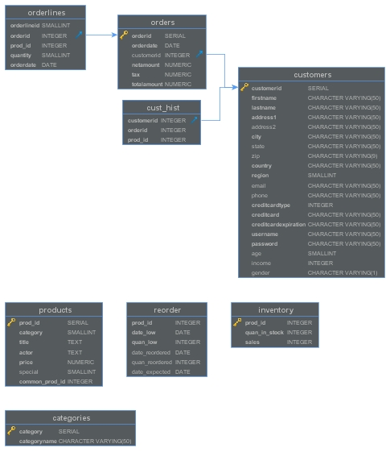
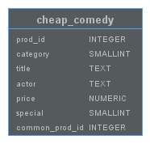
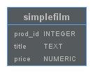
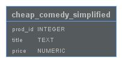

# "*Distributed Database*"
Deveci & Fentler 5CHIT
## Aufgabenstellung
Die detaillierte [Aufgabenstellung](TASK.md) beschreibt die notwendigen Schritte zur Realisierung.

## Vorarbeit
### Prerequisits
- 2 virtuelle Maschinen mit PostgreSQL installiert.
- 2 Host Maschinen

### Vorbereitungsschritte
#### Datenbank
Als erstes muss die Datenbank erstellt werden. Dazu wurde eine fertige Datenbank verwendet und in das 
System integriert. Dazu wurde die Software _WinSCP_ verwendet, um das .zip File mit der Datenbank vom Host auf die VM zu verschieben.  
Anschließend hat man zwei Zip-Files __"ds21.tar.gz"__ und __"ds21_postgresql.tar.gz"__  
Diese Files werden anschließend entzippt. 
```bahs
tar -xvzf <filename>.tar.gz
```
Als nächster Schritt muss die Datenbank noch manuell erstellt werden. Das geht mit folgenden Befehlen:
```bash
psql

DROP DATABASE IF EXISTS DS2;
CREATE DATABASE DS2;
CREATE USER DS2 WITH SUPERUSER;
ALTER USER DS2 WITH PASSWORD 'ds2';
```

Um Tabellen und Einträge in die Datenbank einzufügen, kann das folgende Script verwendet werden.
```bash
sh ds2/pgsqlds2/pgsqld2_create_all.sh
```
Anschließend kann man überprüfen ob die Tabellen in der Datenbank erstellt wurden mit folgendem Befehl:
```bash
psql -d ds2

\dt
```
#### VM anpassen
Um später die VM von außen zu erreichen muss bei den Netzwerkeinstellungen __"Bridged"__ eingestellt sein.

## Implementierung
Die Datenbank besteht aus folgenden Tabellen:


### Horizontale Fragmentierung
  
Bei der horizontalen Fragmentierung werden alle Spalten eines Datensatzes selektiert, bei denen der Wert einer Spalte mit dem anegebenen Wert übereinstimmt.  

__Simpel:__  
Fragmentierung nach Zeilen


Hier in diesem Beispiel wurde eine horizontale Fragmentierung gemacht, bei der nur Tabellenreihen ausgewählt wurden, die von der Kategorie ''Comedy''(5) ist und die weniger als 15 kosten.:  
```sql
CREATE TABLE horizontal.cheap_comedy AS (
    SELECT * FROM products 
    WHERE category=5 
    AND price<15
);

DROP TABLE IF EXISTS horizontal.cheap_comedy_rest;
CREATE TABLE horizontal.cheap_comedy_rest AS (
    SELECT * FROM products
    WHERE prod_id NOT IN (
        SELECT prod_id from horizontal.cheap_comedy
    )
);

CREATE TABLE mergedTableHorizontal AS (SELECT * FROM horizontal.cheap_comedy UNION SELECT * FROM horizontal.cheap_comedy_rest);
```
    
### Vertikale Fragmentierung
  
Bei der vertikalen Fragmentierung werden die Tabellen anhand der Spalten fragmentiert. Um eine saubere Rekonstruktion zu ermöglichen, sollte jede Fragmentierung den Primärschlüssel enthalten. Dadurch, dass nur die nötigen Spalten angezeigt werden, wird ein gewisser Grad an Privatsphäre gewährleistet. Ein Beispiel für vertikale Fragmentierung in Postgres:
```sql
CREATE TABLE vertikal.simplefilm AS SELECT price,prod_id,title FROM product; 

DROP TABLE IF EXISTS vertikal.simplefilm_rest;
CREATE TABLE vertikal.simplefilm_rest AS (SELECT prod_id, actor, category, special, common_prod_id FROM products);

DROP TABLE IF EXISTS vertikal.simplefilm_merged;
CREATE TABLE vertikal.simplefilm_merged AS (SELECT special,common_prod_id,actor,category,price,title FROM vertikal.simplefilm,vertikal.simplefilm_rest WHERE vertikal.simplefilm.prod_id = vertikal.simplefilm_rest.prod_id);
```

### Kombinierte Fragmentierung
  
Die hybride oder kombinierte Fragmentierung ist die Kombination aus der horizontalen und vertikalen Fragmentierung. Sie ist die flexiblste Fragmentationstechnik, da die Informationshergabe so minimal wie möglich gehalten wird.  
Bei der kombinierten Fragmentierung werden nur einzelne Zeilen und Spalten fragmentiert.
```sql
DROP TABLE IF EXISTS combination.cheap_comedy_simplified;
CREATE TABLE combination.cheap_comedy_simplified 
    AS SELECT spalte1,spalte2, ... 
    FROM products 
    WHERE bla=bla;

DROP TABLE IF EXISTS combination.cheap_comedy_rest;
CREATE TABLE combination.cheap_comedy_rest 
    AS SELECT restliche Spalten die nicht in cheap_comedy_simplified sind
    WHERE 
```

## __Zugriff auf die Daten__
---
Um auf die Daten zuzugreifen und das Prinzip der verteilten Datenbank zu zeigen wurde ein Script erstellt. In diesem Script werden die Daten von den Fragmentierten Tabellen ausgelesen. Die __Connection Parameter (ip und datenbank)__ werden dabei aus einem Config-File ausgelesen.

```python
from configparser import ConfigParser

def config(section, filename='database.ini',):
    # create a parser
    parser = ConfigParser()
    # read config file
    parser.read(filename)

    # get section, default to postgresql
    db = {}
    if parser.has_section(section):
        params = parser.items(section)
        for param in params:
            db[param[0]] = param[1]
    else:
        raise Exception('Section {0} not found in the {1} file'.format(section, filename))

    return db
```
Das Configfile ist in Sektionen unterteilt. Diese Sektionen werden nun aus dem db-Objekt ausgelesen, um die Connection-Parameter zu erhalten.
```python
params = config('postgresql:horizontal')

# connect to the PostgreSQL server
conn = psycopg2.connect(**params)
```
Aus dem _Connection Objekt_ wird ein _Cursor Objekt_ gemacht. Dieses wird benötigt um Queries auf der Datenbank auszuführen.
```python
# execute a statement
print('PostgreSQL database version:')
cur.execute('SELECT * FROM horizontal.cheap_comedy;')
dvds = cur.fetchall()
for x in dvds:
    print(x)
```
Am Ende muss die Connection auch wieder geschlossen werden um sauber zu arbeiten. -> 
```python
# close the communication with the PostgreSQL
cur.close()
```

## __EK__
---
Bei der EK war gefragt, dass die Anzahl der Daten vor der Fragmentierung, die Anzahl der Fragmentierten Daten und die Differenz angezeigt werden.  

Bei der __horizontalen Fragmentierung__ wird die Anzahl an Tabellenreihen gezählt.
```python
print('Number of entries in horizontal fragment table:')
cur.execute('SELECT count(*) FROM horizontal.cheap_comedy;')
dvds = cur.fetchall()
for x in dvds:
    print(x)

print('Number of entries in rest table:')
cur.execute('SELECT count(*) FROM horizontal.cheap_comedy_rest;')
dvds = cur.fetchall()
for x in dvds:
    print(x)
    
print('Number of entries in both tables merged into one again:')
cur.execute('DROP TABLE IF EXISTS mergedTableHorizontal;')
cur.execute('CREATE TABLE mergedTableHorizontal AS (SELECT * FROM horizontal.cheap_comedy UNION SELECT * FROM horizontal.cheap_comedy_rest);')
cur.execute('SELECT count(*) FROM mergedTableHorizontal;')
dvds = cur.fetchall()
for x in dvds:
    print(x)
```

Bei der __vertikalen Fragmentierung__ wird die Anzahl an Tabellenspalten gezählt.
```python
print('Number of columns in vertical table:')
cur.execute("SELECT COUNT(*) FROM INFORMATION_SCHEMA.COLUMNS WHERE TABLE_CATALOG = 'ds2' AND TABLE_SCHEMA = 'vertikal' AND TABLE_NAME = 'simplefilm';")
dvds = cur.fetchall()
for x in dvds:
    print(x)

print('Number of columns in the rest table (Anzahl - 1, weil prod_id ja in beiden Tabellen vorhanden sein muss):')
cur.execute("SELECT count(*) FROM INFORMATION_SCHEMA.COLUMNS WHERE TABLE_CATALOG = 'ds2' AND TABLE_SCHEMA = 'vertikal' AND TABLE_NAME = 'simplefilm_rest';")
dvds = cur.fetchall()
for x in dvds:
    print(x)

print('Creating the merged table:')
cur.execute('DROP TABLE IF EXISTS vertikal.simplefilm_merged;')
cur.execute('CREATE TABLE vertikal.simplefilm_merged AS (SELECT vertikal.simplefilm.prod_id, special,common_prod_id,actor,category,price,title FROM vertikal.simplefilm,vertikal.simplefilm_rest WHERE vertikal.simplefilm.prod_id = vertikal.simplefilm_rest.prod_id);')

print('Number of columns in the merged table:')
cur.execute("SELECT count(*) FROM INFORMATION_SCHEMA.COLUMNS WHERE TABLE_CATALOG = 'ds2' AND TABLE_SCHEMA = 'vertikal' AND TABLE_NAME = 'simplefilm_merged';")
dvds = cur.fetchall()
for x in dvds:
    print(x)
```

Bei der __kombinierten Fragmentierung__ wird die kombinierte Anzahl gezählt. Dabei werden einmal die Spalten und einmal die Reihen gezählt.

## __Fragestellungen__
---
- __Frage 1:__ _Was versteht man unter dem Begriff Allokation beim Entwurf einer verteilten Datenbank?_  
__Antwort 1:__ Unter der Allokation versteht man die Verteilung der Fragmente auf verschiedene Stationen (Datenbanken).

- __Frage 2:__ Beschreiben Sie die Korrektheitsanforderungen bei der Fragementierung von verteilten Datenbanken.  
__Antwort 2:__
Folgende Kriterien müssen erfüllt sein:
    - _Rekonstruierbarkeit_:  
    Die usprüngliche Tabelle muss mit den einzelnen Fragmenten wieder hergestellt werden können. 
    - _Vollständigkeit_:  
    Alle Daten sind mindestens einem Fragment zugeordnet
    - _Disjunktheit_:  
    Jedes Datum ist höchstens einem Fragment
    zugeordnet. 


- __Frage 3:__ _Wie geht man bei einer horizontalen DB-Fragemtierung vor? Beantworten Sie diese Frage anhand eines Beispiels._  
__Antwort 3:__ [Hier](#Horizontale-Fragmentierung)

- __Frage 4:__ _Die Transparenz von verteilten Datenbanken ist in mehrere Stufen gegliedert. Beschreiben Sie die Lokale-Schema-Transparenz._  
__Antwort 4:__  
Es gibt __3 Arten der Transparenz:__  
    - __Fragmentierungstransparenz:__ Dabei weiß der Benutzer nicht ob es eine Fragmentierung gibt und wo welche Daten sind. Er macht einfach eine Query und das DBMS kümmert sich um den Rest.
    - __Allokationstransparenz:__ Der Benutzer sieht, dass es verschiedene Fragmente gibt, weiß aber nicht auf welchen Servern die sich befinden.
    - __Lokale Schema-Transparenz:__ Der Benutzer sieht die verschiedenen Fragmente und wo diese gespeichert sind. Er weiß daher ganz genau was er wo selecten muss.

- __Frage 5:__ _Was versteht man unter dem Begriff Fragmentierung beim Entwurf einer verteilten Datenbank?_  
__Antwort 5:__  
Darunter versteht man die Aufteilung von Tabellen(Relationen) in Teile.

- __Frage 6:__ Wie sieht eine vertikale Fragmentierung aus? Erklären Sie die Begriffe anhand von einem Beispiel._  
__Antwort 6:__ [Hier](#Vertikale-Fragmentierung)

## Deployment
Um alle Queries auszuführen, das File allSearches starten, sonst das jedweilige File (horizontalSearch, etc.)
```bash
python src/allSearches.py
```

## Quellen
[1] - [https://stackoverflow.com/questions/658395/find-the-number-of-columns-in-a-table](https://stackoverflow.com/questions/658395/find-the-number-of-columns-in-a-table)    
[2] - [https://www.dbai.tuwien.ac.at/education/dbs/WS2010/folien/Kapitel16.pdf](https://www.dbai.tuwien.ac.at/education/dbs/WS2010/folien/Kapitel16.pdf)  
[3] - [https://www.tutorialspoint.com/distributed_dbms/distributed_dbms_quick_guide.htm](https://www.tutorialspoint.com/distributed_dbms/distributed_dbms_quick_guide.htm)